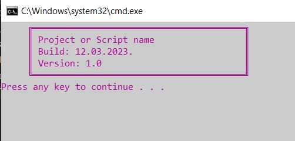
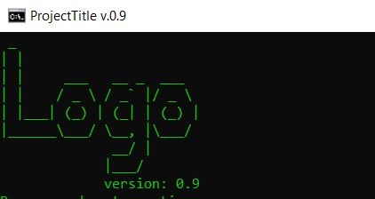

# **Batch Automation Scripts**
  
</br>This is my personal collection of Batch (.bat) and .ps1 scripts which I used for task automation as Mechanical Engineer. Feel free to contribute if you have something interesting.

## **Table of Contents**
- [Batch Create folder structure](#batch-create-folder-structure)
- [Batch Delete files in directory](#batch-delete-files-in-directory)
- [Batch Export directory structure to TXT](#batch-export-directory-structure-to-txt)
- [Batch How to use CHOICE example](#batch-how-to-use-choice-example)
- [Batch List files and folders in directory](#batch-list-files-and-folders-in-directory)
- [Batch List folders with their size](#batch-list-folders-with-their-size)
- [Batch Pair Bluetooth device](#batch-pair-bluetooth-device)
- [Box with the Title, Build date and Version](#box-with-the-title-build-date-and-version)
- [Batch Rename Space to Underscipt](#batch-rename-space-to-underscipt)
- [Batch Run multiple scripts](#batch-run-multiple-scripts)
- [Batch Run Python script](#batch-run-python-script)
- [Powershell Export directory structure to TXT](#powershell-export-directory-structure-to-txt)

- [Colors for Batch scripts](#colors-for-batch-scripts)
---
### **Batch Create folder structure**
For every project I had always the same folder structure. User has to define a project
name and folder structure will be created:
```
├───01-Reference
│   ├───Client
│   └───Older_projects
├───02-Doc
├───03-Email
│   ├───In
│   └───Out
├───04-Working
├───05-Analysis
└───06-Final
```
### **Batch Delete files in directory**
This script will delete all files with predefined extension. For the example, if you want to delete filesto delete all .txt files in directory.
For deleting files in subfolders, add /s - Subfolder
</br>Example:
```
DEL /s *.bmp
```

### **Batch Export directory structure to TXT**
This script will export all subfolders and list of files into one TXT file, named: generated_tree_list.txt.
</br>This was very usefull when I had to deliver project to a client.
</br>Example of exported list:
```
+---Data
    |       |   |   chunkmanifest
    |       |   |   initfs_Win32
    |       |   |   layout.toc
    |       |   |   
    |       |   \---Win32
    |       |       |   chunks0.sb
    |       |       |   chunks0.toc
    |       |       |   globals.sb
    |       |       |   globals.toc
    |       |       |   mpvehicles.sb
```

### **Batch How to use CHOICE example**
This is simple example of using CHOICE in Batch. It's good when we user had multiple options to chose.

### **Batch List files and folders in directory**
This script will generate an TXT file with a list of all files and folders in parent folder.
</br>Example of exported list:
```
.gitignore
Batch_Create_folder_structure.bat
Batch_Delete_files_in_directory.bat
Batch_Export_directory_structure_to_TXT.bat
README.md
List.txt
Subfolder-1
```
NOTES:
</br>For a list of all files and folders, use:
```
DIR /b
```
For a list of files, folders and files in subfolders with absolut paths, use:
```
DIR /b /s
```
For a list of all files, without folders, use:
```
DIR /b /a-d
```
For a list of all files, with files in subfolders with absolut paths, but without subfolders, use:
```
DIR /b /a-d /s
```
For a list of files with predefined extension, add for e.g. *.pdf:
#### For more extensions, add *.pdf *.mp4 *.jpg
```
DIR /b /a-d /s *.pdf
DIR /b /a-d /s *.pdf *.mp4 *.jpg
```

### **Batch List folders with their size**
This script will create a .TXT file with a list of all sub-folders with their size in KB, MB, GB or TB.  This is one of my favorite scripts.</br>The found it very useful.
This is example of exported list:
```
AutoCAD Mechanical 2019 --- 5,1 GB 
Autodesk Inventor Pro 2018 --- 10,2 GB 
Autodesk Vault Basic 2020 x64 --- 1,2 GB 
KISSsoft 2022 --- 2,2 GB 
MS Office 2016 Pro X64 --- 2,2 GB 
Wolfram Mathematica 11.2.0.0 --- 3,3 GB 
```
### **Batch Pair Bluetooth device**
I have Samsung Soundbar T6-Series which is connected via Bluetooth with my pc.
</br>After 20-30 min of inactivity, it goes into sleep mode and turn off.
</br>It's very annoying to turn on and connect speakers a few times a day so I use this script! It's a bit slow, but less hassle. 
</br> Requrements: Bluetooth Command Line Tools needs to be installed before using this script. You can download it [here](https://bluetoothinstaller.com/bluetooth-command-line-tools/bluetooth-sample-scripts.html).

### **Box with the Title, Build date and Version**
This is a template script which I used for some scripts.
</br>File is saved with Encoding: ANSI, otherwise, it won't look good.
</br> Here is how it looks:
</br>

### **Batch Rename Space to Underscipt**
This is one of my first Batch scripts.
</br>It will rename all *blanks* (spaces) into _(underscore).
</br>Operation will be applied to all files, no mather of extension.
</br>Example:
```
This file.txt
:: will became:
This_file.txt
```

### **Batch Run multiple scripts**
This script will run multiple predefined scripts.
</br> Run scripts one after another:
```
call script_1.bat
call script_2.bat
```
Run all scripts, no matter if the previous has finished the job:
```
START /b script_11.bat
START /b script_22.bat
```

### **Batch Run Python script**
This is simple example of creating a shortcut for running a Python script.
</br>Usualy, I put this Batch file on the desktop.
</br>Reason: Nobody likes to type manually in CMD. :)
```
C:\Python\Python38-32\python.exe D:\Python\Tkinter_GUI_Example_1.py
```
Command have 2 parts, first is a location of python.exe and second is location of Python script.

### **Powershell Export directory structure to TXT**
Same as [Batch Export directory structure to TXT](#batch-export-directory-structure-to-txt), this script do the same thing, but in Powershell.
</br>It look more beautiful that Batch export.
</br>Example of exported list:
```
D:.
├───common
│   └───Battlefield 1
│       ├───Core
│       │   ├───codecs
│       │   └───imageformats
│       ├───Data
│       │   └───Win32
│       │       ├───installation
│       │       │   ├───mp_install
│       │       │   ├───mp_ravines_install
│       │       │   ├───mp_shoveltown_install
│       │       │   ├───mp_trench_install
│       │       │   ├───xpack1_install
│       │       │   ├───xpack2_install
│       │       │   ├───xpack3-1_install
│       │       │   ├───xpack3_install
│       │       │   └───xpack4_install
```

### **Batch ASCII Logo example**
This is an example of using ASCII to draw a logo for a Project.
</br> I used this website to generate ASCII:
[patorjk.com](https://patorjk.com/software/taag/#p=display&f=Graffiti&t=Type%20Something%20).
<br/>Here is how it looks:
</br>

---
## **Colors for Batch scripts**
| Background |    Text     |
|------------|-------------|
| 0 = black  | 8 = gray    |
| 1 = navy   | 9 = blue    |
| 2 = green  | A = lime    |
| 3 = teal   | B = cyan    |
| 4 = maroon | C = red     |
| 5 = purple | D = fuchsia |
| 6 = olive  | E = yellow  |
| 7 = silver | F = white   |

</br> Example of defining color:
```
:: This will give us black background and lime text.
COLOR 0A
```
